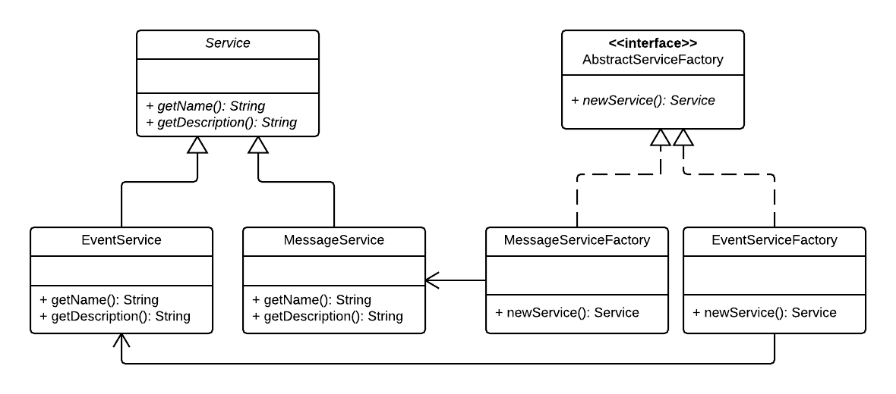

### Abstract factory pattern

#### A creational pattern

Abstract factory pattern add a level of abstraction to factory pattern (no input and if else structure needed here). Definition and implementation are totally decoupled here.

Source code stems from the following UML diagram:

